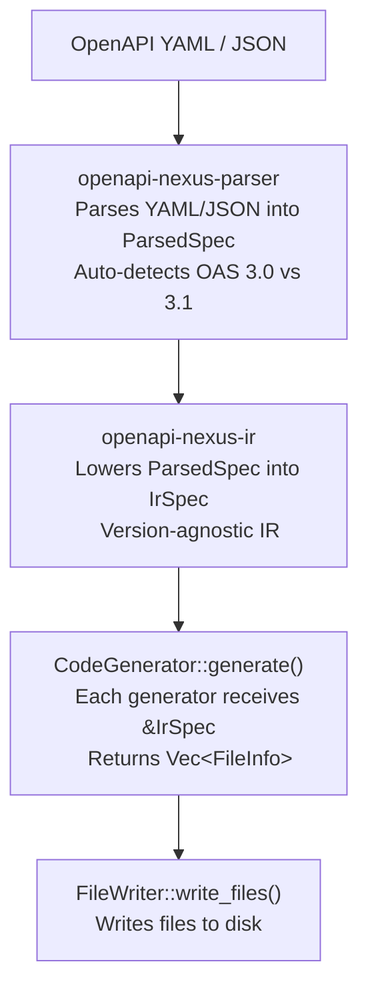

# Architecture

## Pipeline



Lowering happens once in the orchestrator (`OpenApiCodeGenerator`). Generators never touch raw OpenAPI types.

## Workspace Crates

### Core pipeline

| Crate | Purpose |
|-------|---------|
| `openapi-nexus` | CLI binary, orchestrator (`OpenApiCodeGenerator`, `GeneratorRegistry`) |
| `openapi-nexus-parser` | Parses YAML/JSON into `ParsedSpec` |
| `openapi-nexus-spec` | Raw OpenAPI types (`OpenApiV30Spec`, `OpenApiV31Spec`) |
| `openapi-nexus-ir` | Lowers parsed spec to `IrSpec` via `lower::lower()` |
| `openapi-nexus-core` | Shared traits (`CodeGenerator`, `FileWriter`, `CombinedGenerator`), enums (`GeneratorType`, `Language`) |
| `openapi-nexus-config` | Configuration loading (CLI > env > TOML > defaults) |

### Generators

| Crate | Language | Emission |
|-------|----------|----------|
| `openapi-nexus-typescript-fetch` | TypeScript | `sigil-stitch` |
| `openapi-nexus-go-http` | Go | `sigil-stitch` |

Both generators live under `crates/generators/`.

### Test infrastructure

| Crate | Purpose |
|-------|---------|
| `openapi-nexus-test-utils` | Shared golden-test harness (`run_golden_test`, `generate_files`) |
| `fixture-generators/*` | Generate type-checked OAS fixtures from Rust + utoipa |

## The CodeGenerator Trait

```rust
pub trait CodeGenerator {
    fn language(&self) -> Language;
    fn generator_type(&self) -> GeneratorType;
    fn generate(&self, ir: &IrSpec) -> Result<Vec<FileInfo>, Box<dyn Error + Send + Sync>>;
}
```

`CombinedGenerator` is a blanket impl of `CodeGenerator + FileWriter`. The orchestrator stores generators as `Box<dyn CombinedGenerator + Send + Sync>` and calls `generate()` then `write_files()`.

## Code Emission

Both generators use [sigil-stitch](https://github.com/adamcavendish/sigil-stitch), a type-safe code generation framework. sigil-stitch provides:

- Language-specific type systems (TypeScript, Go)
- Import tracking and deduplication
- Width-aware pretty printing
- The `sigil_quote!` macro for inline code templates

Each generator's `sigil_emit*.rs` files contain the emission logic that transforms IR types into sigil-stitch AST nodes.
