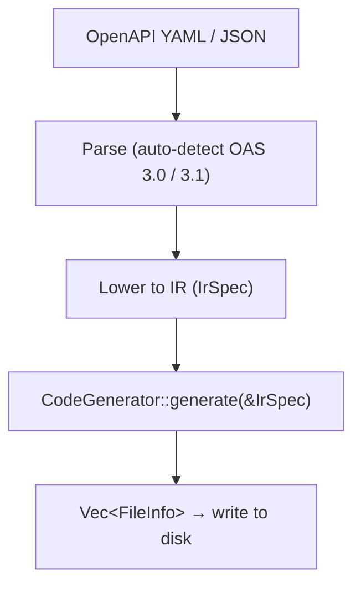

# Introduction

openapi-nexus is a modular OpenAPI 3.1 code generator written in Rust. It reads an OpenAPI specification and produces type-safe client libraries for multiple languages.

## Supported Languages

| Language | Generator ID | Status |
|----------|-------------|--------|
| TypeScript (fetch) | `typescript-fetch` | Stable |
| Go (net/http) | `go-http` | Stable |

## How It Works

openapi-nexus follows a compiler-like pipeline:

Parsing and lowering happen once in the orchestrator. Each generator receives a pre-lowered `IrSpec` and produces a list of files. Generators use [sigil-stitch](https://github.com/adamcavendish/sigil-stitch) for type-safe, import-aware code emission.

## Key Properties

- **Deterministic output.** The same spec always produces the same files. Golden tests enforce byte-for-byte reproducibility.
- **Compile-checked output.** CI runs `tsc --noEmit` on every generated TypeScript file and `go build ./...` on every generated Go file.
- **Single binary.** The CLI is a self-contained Rust binary with no runtime dependencies.

## Links

- [Repository](https://github.com/adamcavendish/openapi-nexus)
- [Releases](https://github.com/adamcavendish/openapi-nexus/releases)
