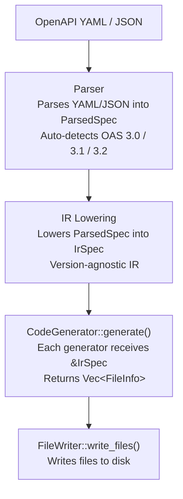

# Architecture

## Pipeline



Lowering happens once in the orchestrator (`src/generators/orchestrator.rs`). Generators never touch raw OpenAPI types.

## Module Layout

openapi-nexus is a single crate. All modules live under `src/`:

```
src/
├── cli/              CLI argument parsing and entry point
├── codegen/          CodeGenerator/FileWriter traits, GeneratorType, Language enums
├── config/           Configuration loading (CLI > env > TOML > defaults)
├── ir/               IrSpec types and lowering passes
│   └── lower/        v30.rs, v31.rs, v32.rs
├── spec/             Raw OAS types (v30, v31, v32)
├── parser/           YAML/JSON parsing, OAS version auto-detection
└── generators/       One submodule per generator
    ├── typescript/fetch/
    ├── go/http/
    ├── rust/common/         Shared model + API emission for Rust backends
    ├── rust/reqwest/
    ├── rust/ureq/
    ├── rust/aioduct/
    ├── python/common/       Shared model + API emission for Python backends
    ├── python/httpx/
    ├── python/requests/
    ├── java/okhttp/
    ├── kotlin/okhttp/
    ├── orchestrator.rs      Orchestrates parse → lower → generate → write
    └── registry.rs          Maps GeneratorType to constructor
```

## The CodeGenerator Trait

```rust
pub trait CodeGenerator {
    fn language(&self) -> Language;
    fn generator_type(&self) -> GeneratorType;
    fn generate(&self, ir: &IrSpec) -> Result<Vec<FileInfo>, Box<dyn Error + Send + Sync>>;
}
```

`CombinedGenerator` is a blanket impl of `CodeGenerator + FileWriter`. The orchestrator stores generators as `Box<dyn CombinedGenerator + Send + Sync>` and calls `generate()` then `write_files()`.

## Code Emission

All generators use [sigil-stitch](https://github.com/adamcavendish/sigil-stitch), a type-safe code generation framework. sigil-stitch provides:

- Language-specific type systems (TypeScript, Go, Rust, Python, Java, Kotlin)
- Import tracking and deduplication
- Width-aware pretty printing
- The `sigil_quote!` macro for inline code templates with `$if`, `$for`, `$let` directives

Each generator's `sigil_emit*.rs` files contain the emission logic that transforms IR types into sigil-stitch AST nodes.
