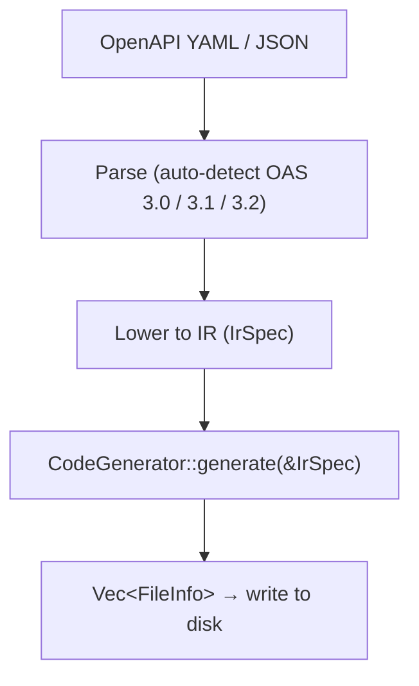

# Introduction

openapi-nexus is a modular OpenAPI code generator written in Rust. It reads an OpenAPI specification (3.0, 3.1, or 3.2) and produces type-safe client libraries for multiple languages.

## Supported Languages

| Language | Generator ID | HTTP Client | Status |
|----------|-------------|-------------|--------|
| TypeScript | `typescript-fetch` | fetch | Beta |
| Go | `go-http` | net/http | Beta |
| Rust | `rust-reqwest` | reqwest | Beta |
| Rust | `rust-ureq` | ureq | Beta |
| Rust | `rust-aioduct` | aioduct | Beta |
| Python | `python-httpx` | httpx | Beta |
| Python | `python-requests` | requests | Beta |
| Java | `java-okhttp` | OkHttp | Beta |
| Kotlin | `kotlin-okhttp` | OkHttp | Beta |

## How It Works

openapi-nexus follows a compiler-like pipeline:

Parsing and lowering happen once in the orchestrator. Each generator receives a pre-lowered `IrSpec` and produces a list of files. Generators use [sigil-stitch](https://github.com/adamcavendish/sigil-stitch) for type-safe, import-aware code emission.

## Key Properties

- **Deterministic output.** The same spec always produces the same files. Golden tests enforce byte-for-byte reproducibility.
- **Compile-checked output.** CI runs language-specific compile checks on every generated file: `tsc --noEmit` (TypeScript), `go build` (Go), `cargo check` (Rust), `pyright` (Python), `gradle compileJava` (Java), `gradle compileKotlin` (Kotlin).
- **Single binary.** The CLI is a self-contained Rust binary with no runtime dependencies.

## Links

- [Repository](https://github.com/adamcavendish/openapi-nexus)
- [Releases](https://github.com/adamcavendish/openapi-nexus/releases)
